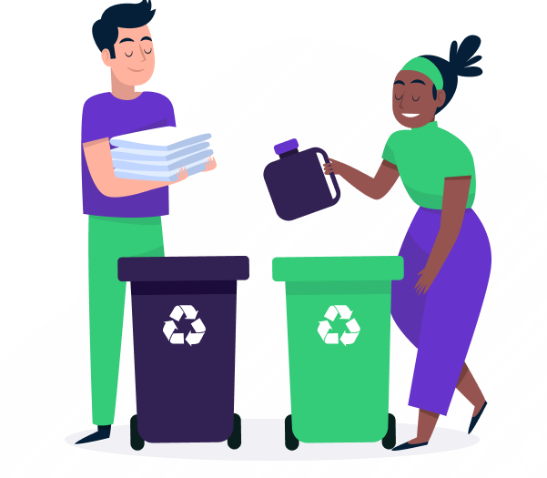
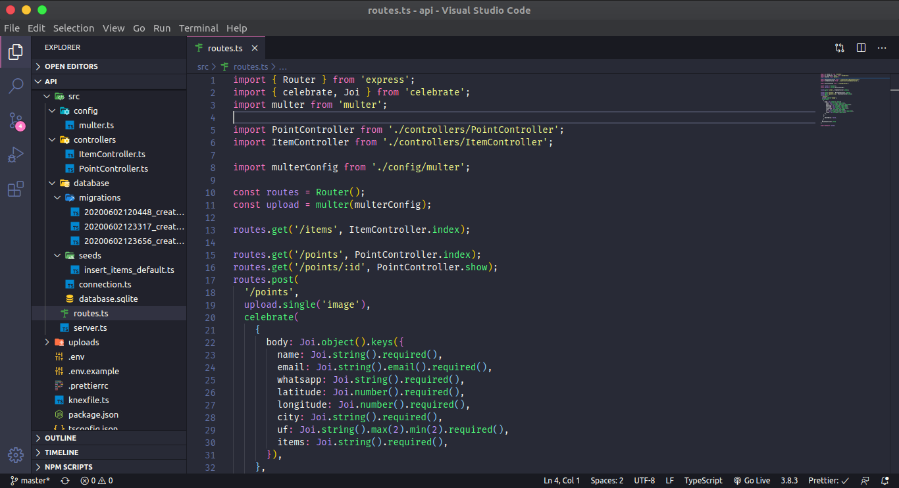

<h1 align="center">
  
  <br/>
  
</h1>

<p align="center">
  <a href="https://github.com/ronnyacacio">
    
  </a>

  <a href="#">
    
  </a>

  <a href="https://github.com/ronnyacacio/ecoleta/stargazers">
    
  </a>

  <a href="https://github.com/ronnyacacio/ecoleta/commits/master">
    
  </a>

  <a href="#">
    
  </a>

  <a href="https://github.com/ronnyacacio/ecoleta/blob/master/LICENSE.md">
    
  </a>
</p>

<br />

## 💻 Projeto

Projeto desenvolvido durante a <strong>Next Level Week</strong> que tem como objetivo facilitar o encontro de coletores de resíduos nas suas proximidades.
O <strong>Ecoleta</strong> serve como um Marketplace, uma conexão entre empresas ou entidade que coletam resíduos, sejam eles orgânicos ou inorgânicos, à pessoas que precisam fazer descarte dos resíduos.

<br />

## 🔨 API

<h1 align="center">
  
</h1>

## 🌐 WEB

<h1 align="center">
    
</h1>

## 📱 Mobile

<h1 align="center">
    
</h1>

<br />

## 🚀 Tecnologias

Esse projeto foi desenvolvido com as seguintes tecnologias:

- [Node.js](https://nodejs.org/en/)
- [React](https://reactjs.org)
- [React Native](https://facebook.github.io/react-native/)
- [Expo](https://expo.io/)
- [Knex](http://knexjs.org/)
- [API do IBGE para consumo do endereço](https://servicodados.ibge.gov.br/api/docs/localidades?versao=1#api-UFs-estadosGet)
- [React-Dropzone para upload de imagens](react-dropzone)
- [Leaflet](https://leafletjs.com/examples/quick-start/)
- [Yup](https://github.com/jquense/yup)
- [Celebrate](https://github.com/arb/celebrate)

<br />

## 🔖 Layout

Acesse o layout pelo [Figma](https://www.figma.com/file/1SxgOMojOB2zYT0Mdk28lB/).

## 🔥 Instalação

```bash
# Clone este repositório
$ git clone https://github.com/ronnyacacio/ecoleta.git

# Navegue até a pasta api e execute os seguintes comandos:
$ yarn
$ npx knex migrate:latest
$ npx knex seed:run
$ yarn dev

# Depois disso, entre na pasta web e execute os comandos:
$ yarn
$ yarn start

# E finalmente, entre na pasta mobile e execunte os comandos:
$ yarn
$ expo start

# Observações:
- Não esqueça de mudar a baseURL no arquivo `src/services/api.ts` das pastas web e mobile para o IP da sua máquina
```

<p align="center">
  Feito com 💚 by <a href="https://www.linkedin.com/in/ronnyacacio/"> Ronny Acácio </a>
</p>
